

---

**All of our released code is available on [Github](https://github.com/weicheng-huang-mechanics?tab=repositories). Here, we provide a basic MATLAB tutorial for the nonlinear numerical simulation of flexible structures using the discrete differential geometry method.**

---
Mass_spring_system

Single_DOF: [Single DOF mass spring system](https://github.com/weicheng-huang-mechanics/DDG_Tutorial/tree/main/mass_spring_system/single_DOF)
 

Multiple_DOF: [Multiple DOF mass spring system](https://github.com/weicheng-huang-mechanics/DDG_Tutorial/tree/main/mass_spring_system/multiple_DOF)
 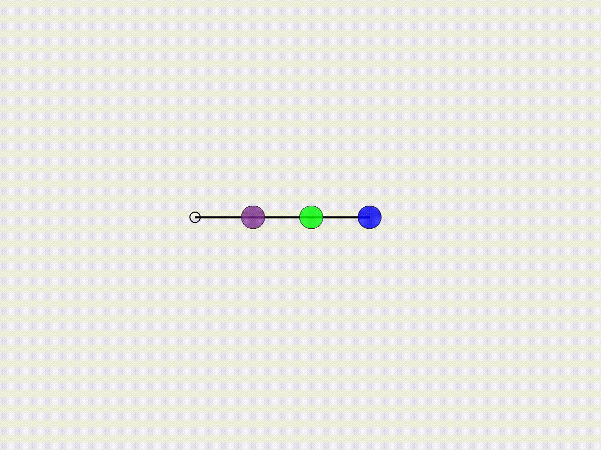

---

2d_curve

Case_1: [Beam deflection under gravity](https://github.com/weicheng-huang-mechanics/DDG_Tutorial/tree/main/2d_curve/Case_1)
 

Case_2: [Buckling of a compressive beam](https://github.com/weicheng-huang-mechanics/DDG_Tutorial/tree/main/2d_curve/Case_2)
 

Case_3: [Snapping of a pre-buckled beam](https://github.com/weicheng-huang-mechanics/DDG_Tutorial/tree/main/2d_curve/Case_3)
 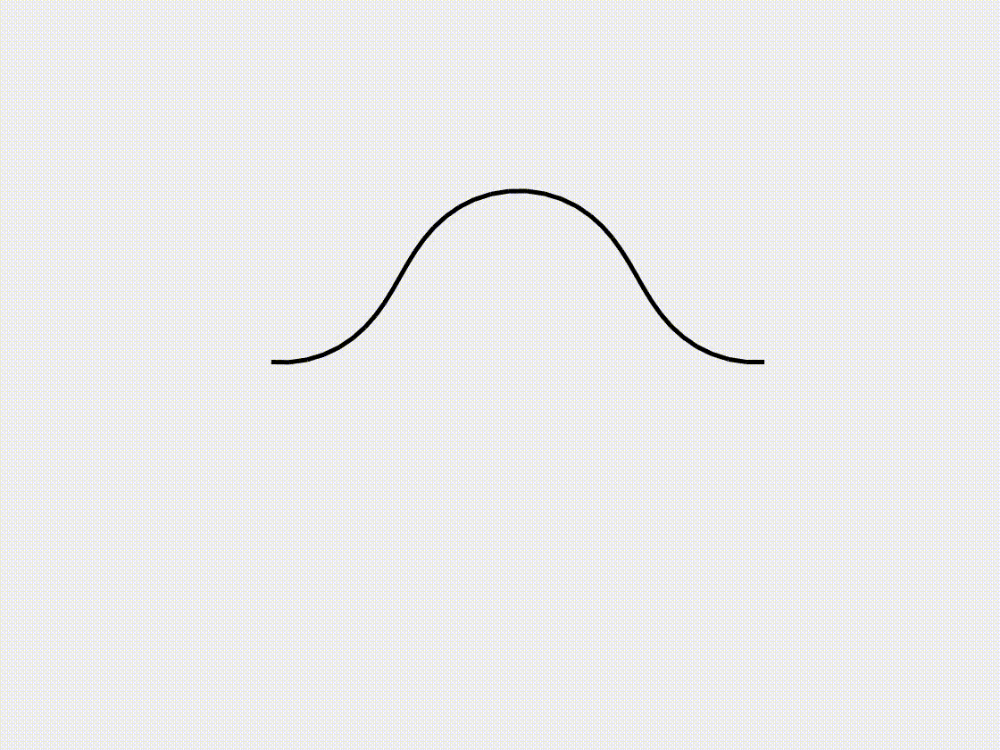

---

3d_curve

Case_1: [3D helix under gravity](https://github.com/weicheng-huang-mechanics/DDG_Tutorial/tree/main/3d_curve/Case_1)
 

Case_2: [Bifurcation of pre-buckled ribbon](https://github.com/weicheng-huang-mechanics/DDG_Tutorial/tree/main/3d_curve/Case_2)
 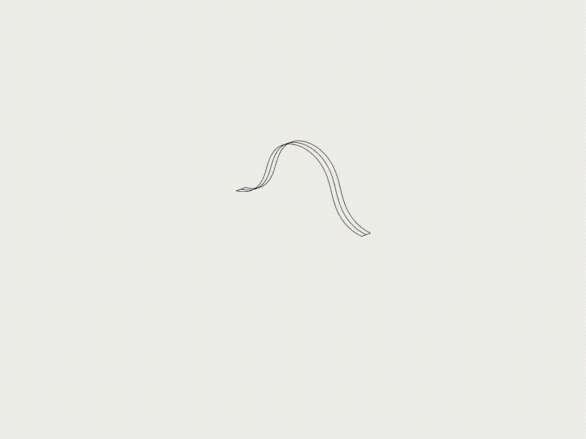

Case_3: [Growth of annular ribbon](https://github.com/weicheng-huang-mechanics/DDG_Tutorial/tree/main/3d_curve/Case_3)
 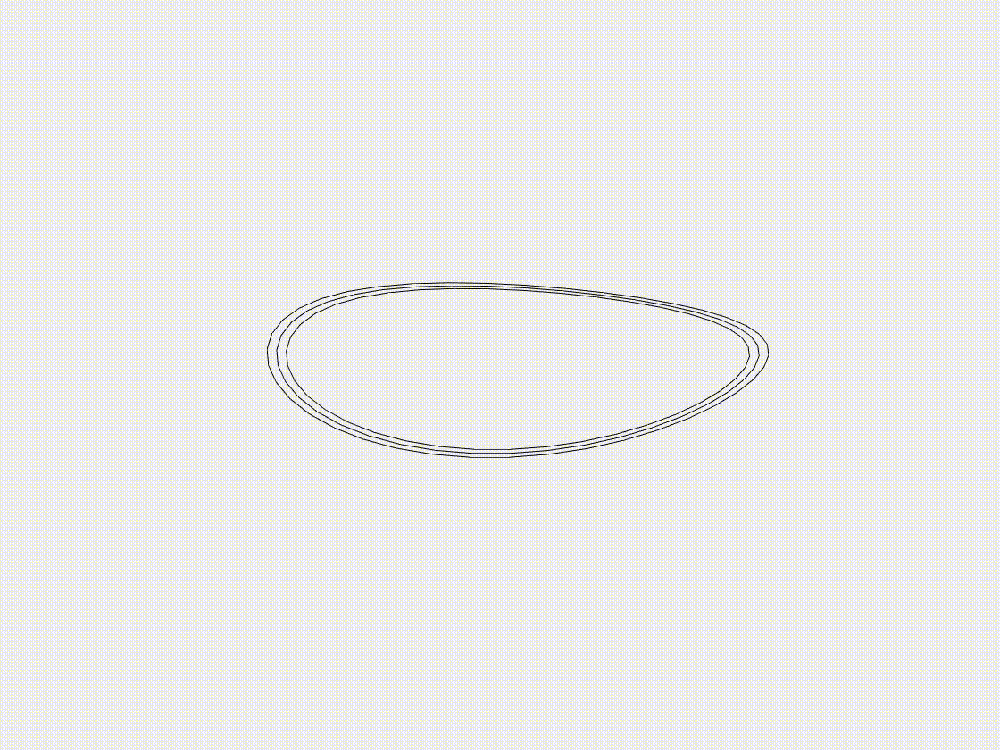

---

2d_surface

Case_1: [Inflation of an axisymmetric plate](https://github.com/weicheng-huang-mechanics/DDG_Tutorial/tree/main/2d_surface/Case_1)
 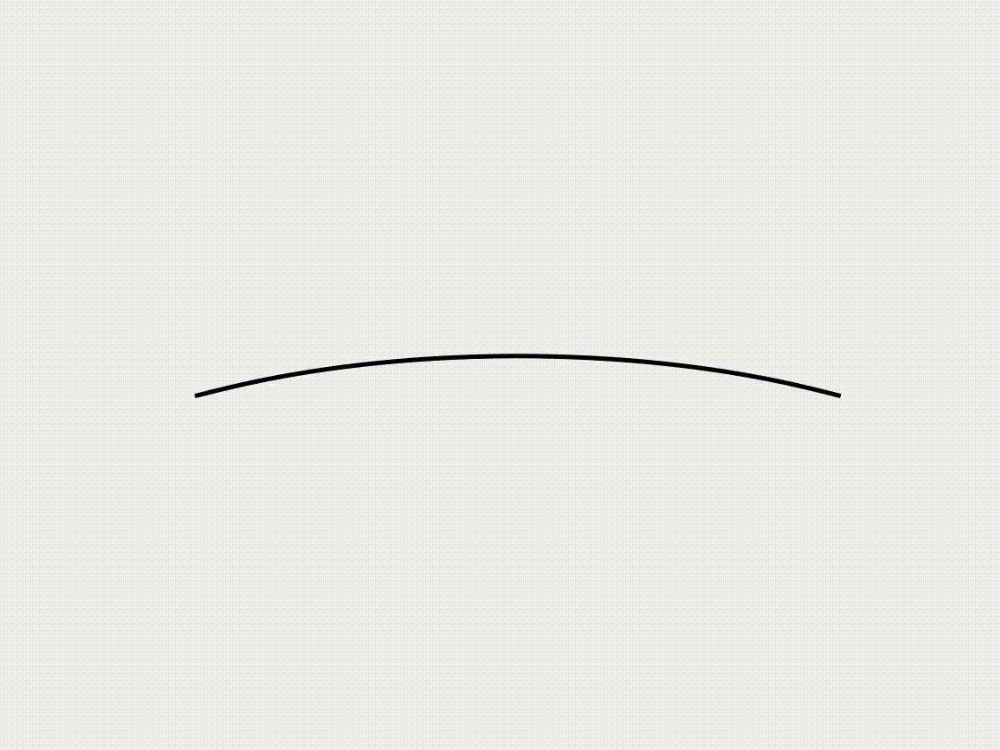

Case_2: [Snap-through of the axisymmetric shell](https://github.com/weicheng-huang-mechanics/DDG_Tutorial/tree/main/2d_surface/Case_2)
 

---

3d_surface

Case_1: [Plate deflection under gravity](https://github.com/weicheng-huang-mechanics/DDG_Tutorial/tree/main/3d_surface/Case_1)
 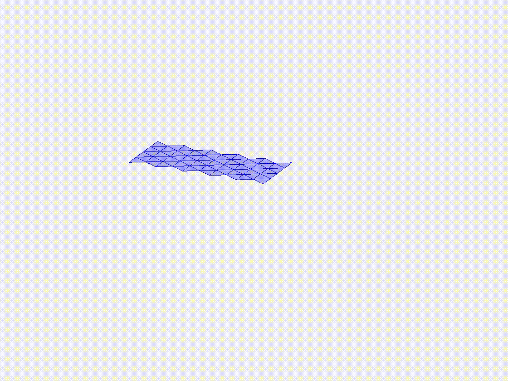

Case_2: [Plate wrinkling under gravity](https://github.com/weicheng-huang-mechanics/DDG_Tutorial/tree/main/3d_surface/Case_2)
 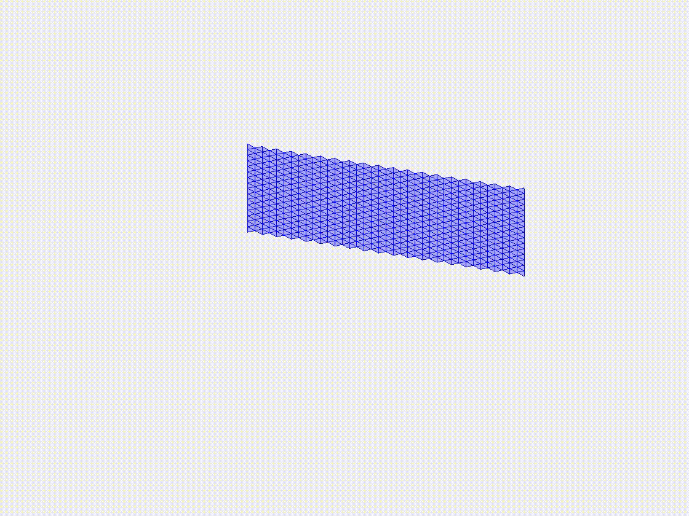

Case_3: [Indentation of a cylindrical shell](https://github.com/weicheng-huang-mechanics/DDG_Tutorial/tree/main/3d_surface/Case_3)
 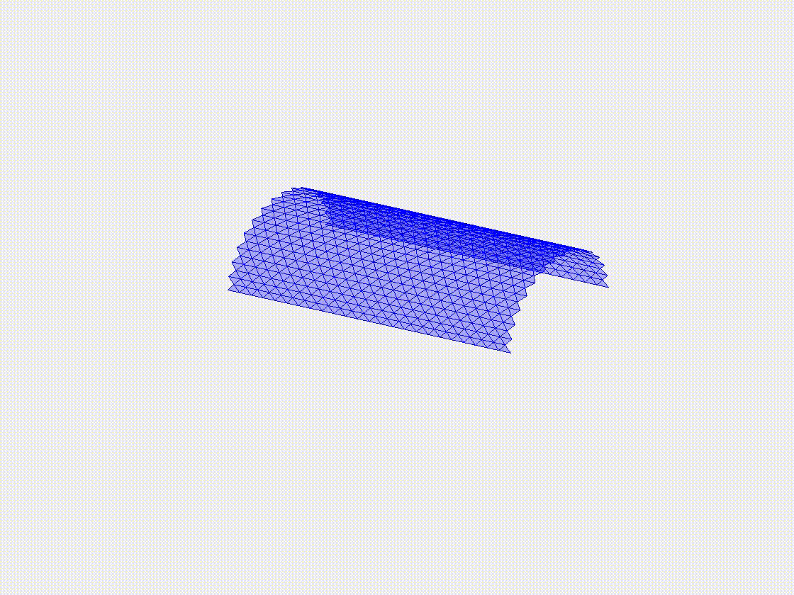
  
---

Rod_network

Case_1: [Flexible net under gravity](https://github.com/weicheng-huang-mechanics/DDG_Tutorial/tree/main/rod_network/Case_1)
 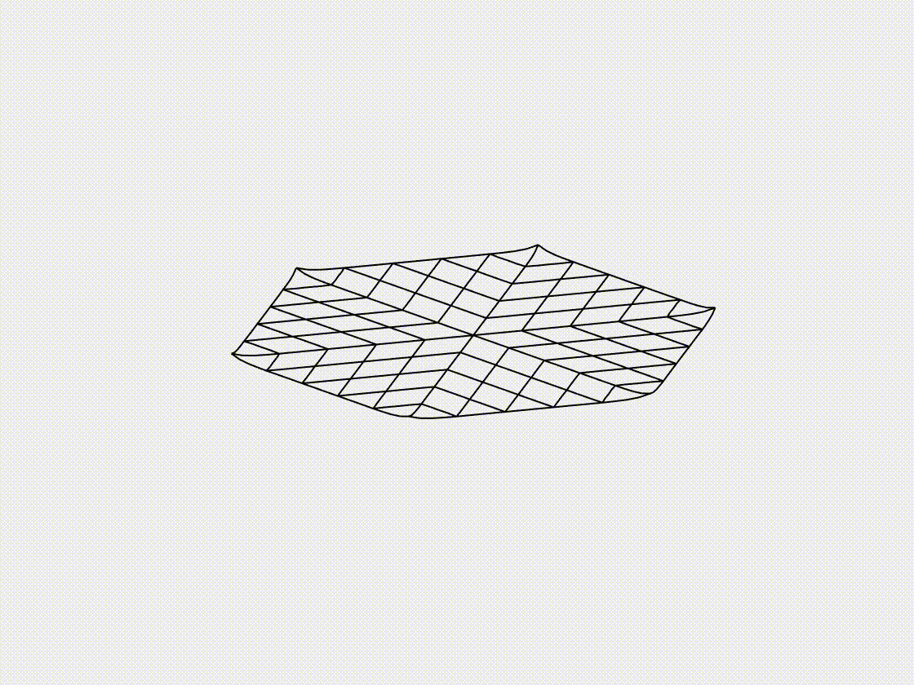

Case_2: [Form-finding of gridshell](https://github.com/weicheng-huang-mechanics/DDG_Tutorial/tree/main/rod_network/Case_2)
 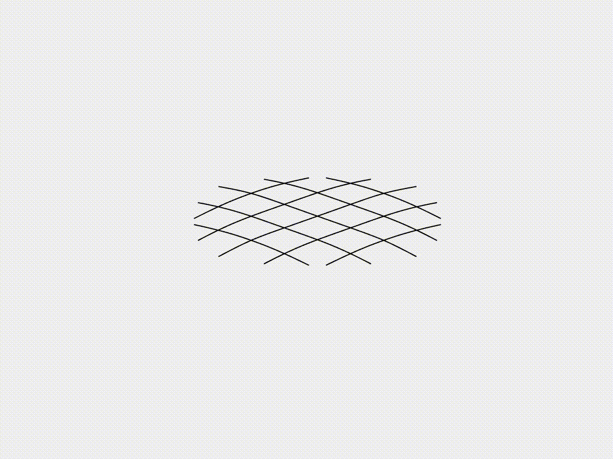

Case_3: [Lattice grid under gravity](https://github.com/weicheng-huang-mechanics/DDG_Tutorial/tree/main/rod_network/Case_3)
 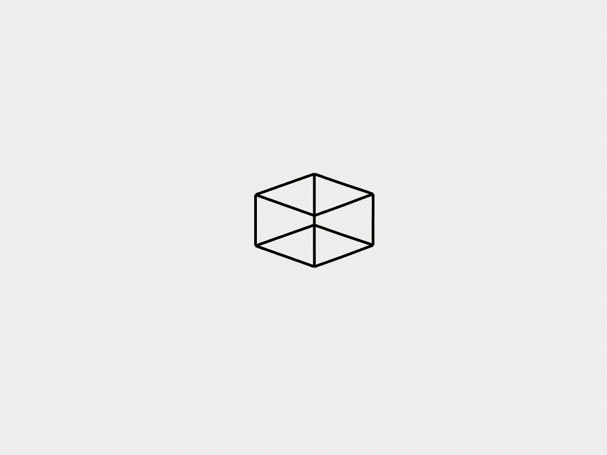
    
---

Hyper_elastic

Case_1: [Hyperelastic planar cable](https://github.com/weicheng-huang-mechanics/DDG_Tutorial/tree/main/hyper_elastic/Case_1)
 

Case_2: [Hyperelastic axisymmetric membrane](https://github.com/weicheng-huang-mechanics/DDG_Tutorial/tree/main/hyper_elastic/Case_2)
 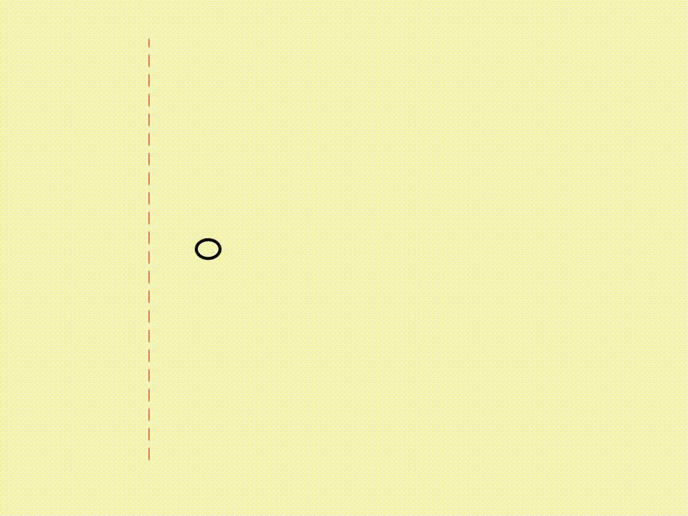

---
Soft_robot

Case_1: [Magnetic actuation](https://github.com/weicheng-huang-mechanics/DDG_Tutorial/tree/main/soft_robot/Case_1)
 

Case_2: [Fluid-structure interaction](https://github.com/weicheng-huang-mechanics/DDG_Tutorial/tree/main/soft_robot/Case_2)
 

Case_3: [Frictional contact](https://github.com/weicheng-huang-mechanics/DDG_Tutorial/tree/main/soft_robot/Case_3)
 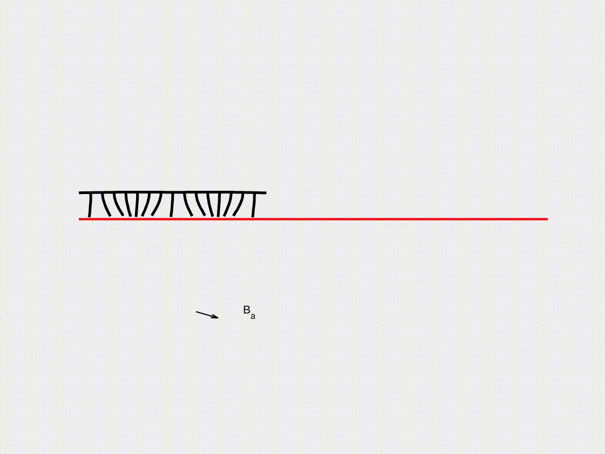
