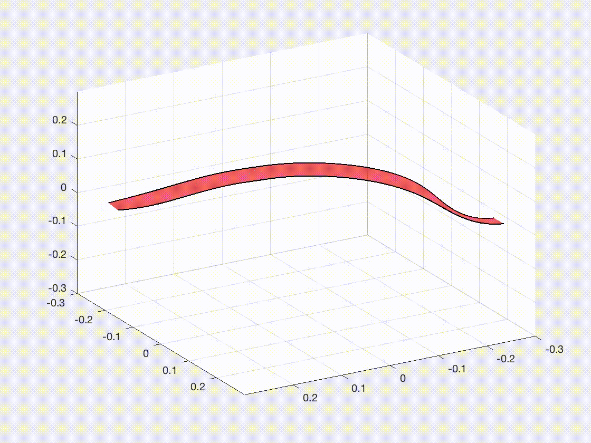



---

**Here we present some interesting videos from our numerical simulators.**

---

Dancing net.
 

---

Form-finding of a hollow gridshell by using buckling instability.
 

---

Snap of a pre-stressed elastic gridshell.
 

---

Capture of space debris using a tether-net system.
 

---

Snap of an elastic gridshell
 

---

Handling cloth.
 

---

Cloth simulation.
 

---

Jumping behavior of a bi-stable shell actuator.
 

---

Shear-induced bifurcation of an elastic plate
 

---

Elastic-plastic rod.
 

---

A rigid ring sliding on an elastic rod.
 

---

Folding of an annular ribbon.
 

---

Multistability of an origami annulus.
 

---

The rotational-induced flip of an elastic strip.
 

---

The rotational-induced snap-through of an elastic strip.
 

---

Contact between two rods.
 

---

Snap-induced jumping robot.
 

---

Rolling motion of SMA-powered soft robots. 
 

---

Swimming motion of SMA-powered soft robots. 
 

---

The crawling motion of a cilia robot
 

---

The rolling motion of a cilia robot.
 

---

The pressurized membrane as a soft actuator.
 

---

Hysteresis of a helical magnetic rod.
 

---

Directional control of bacteria flagellar propulsion. 
 

---

Bundling behavior of two helical rods rotating in a viscous environment.
 

