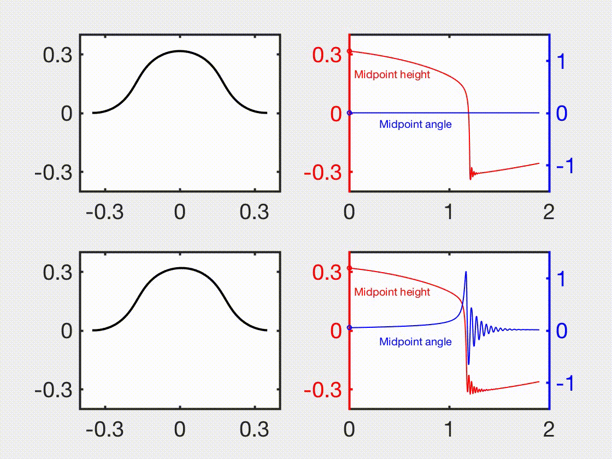



**Here we present some interesting videos for demonstrations.**

---

Rolling motion of SMA-powered soft robots. 
 

---

Swimming motion of SMA-powered soft robots. 
 

---

Bilayer soft robot for gripping.
 

---

Bilayer soft robot for crawling.
 

---

Bilayer soft robot for crawling.
 

---

Bilayer soft robot for jumping.
 

---

Bilayer soft robot for swimming.
 

---

Capture of space debris using a tether-net system.
 

---

Magnetic-actuated snap-through, mode 1.
 

---

Magnetic-actuated snap-through, mode 2.
 

---

Magnetic-actuated snap-through, mode 3.
 

---

Soft continuum guidewire moving in a tube.
 

---

Control of a soft continuum guidewire by using magnetic fields.
 

---

Magnetic beam.
 

---

Dancing net.
 

---

Handling cloth.
 

---

Cloth simulation.
 

---

Snap of an elastic gridshell.
 

---

The crawling motion of a cilia robot.
 

---

The rolling motion of a cilia robot.
 

---

Jumping behavior of a bi-stable shell actuator.
 

---

Inflation of an axisymmetric torus。
 

---

Shear-induced bifurcation of an elastic plate.
 

---

Elastic-plastic rod.
 

---

Form-finding of a hollow gridshell by using buckling instability.
 

---

Snap of a pre-stressed elastic gridshell.
 

---

A rigid ring sliding on an elastic rod.
 

---

Folding of an annular ribbon.
 

---

Multistability of an origami annulus.
 

---

Symmetric and asymmetric bifurcations of serpentine strips.
 

---

The rotational-induced snap-through of an elastic strip.
 

---

Symmetric and asymmetric snap-through
 

---

Minimum surface by an elastic curve.
 

---

The rotational-induced flip of an elastic strip.
 

---

Contact between two rods.
 

---

Rod deployment with a prescribed pattern.
 

---

Inverse design of a planar beam with a target configuration.
 

---

Snap-induced jumping robot.
 

---

The pressurized membrane as a soft actuator.
 

---

Hysteresis of a helical magnetic rod.
 

---

Directional control of bacteria flagellar propulsion.
 

---

Bundling behavior of two helical rods rotating in a viscous environment.
 

