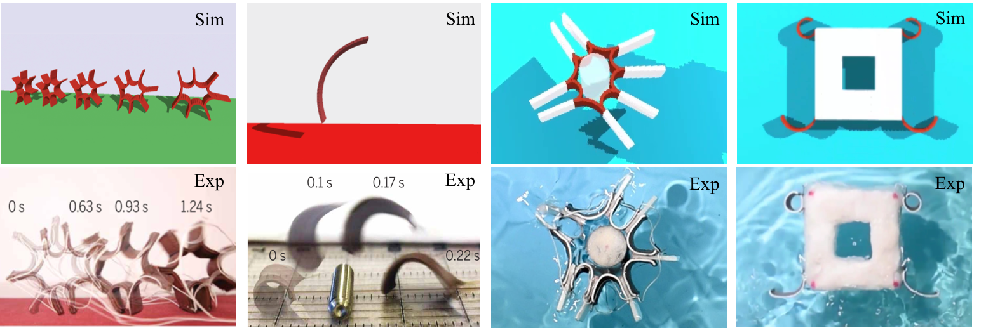
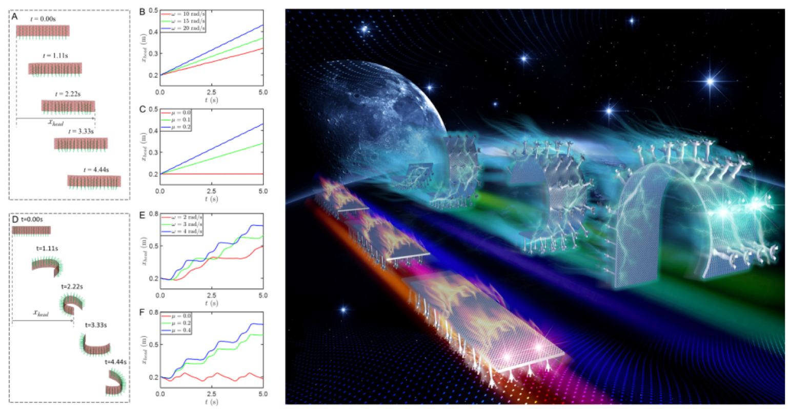
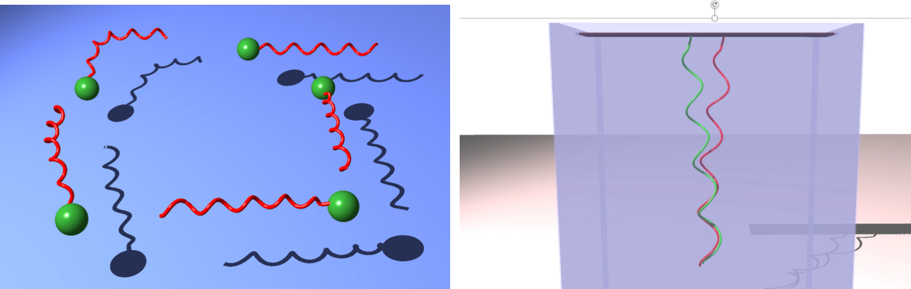
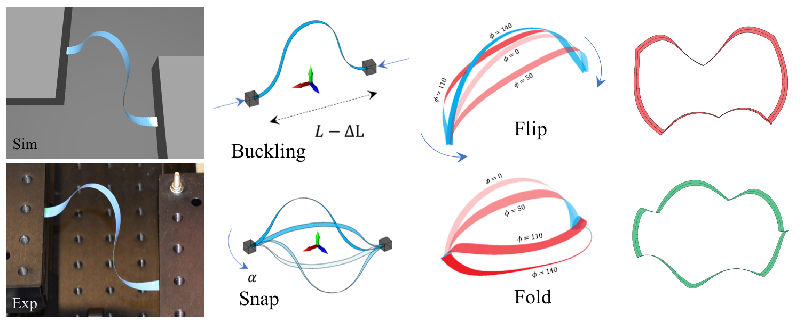
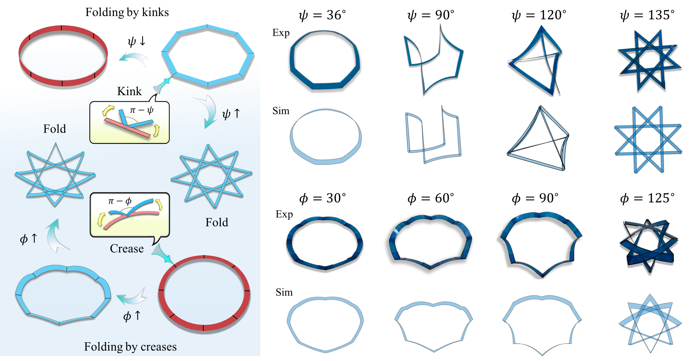
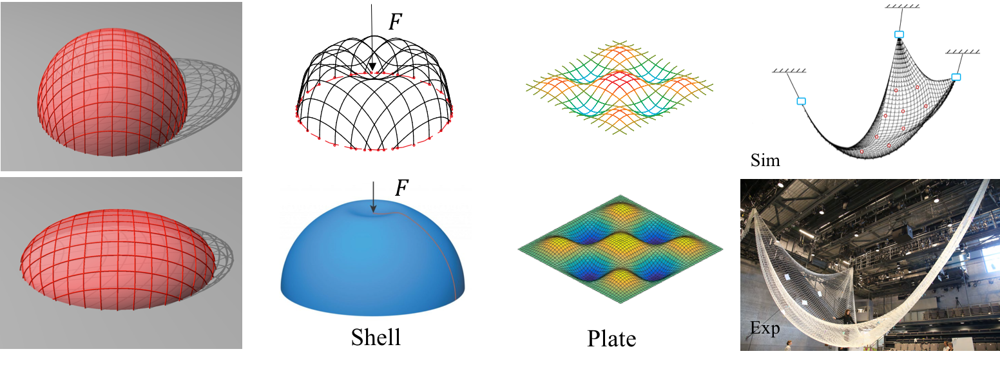
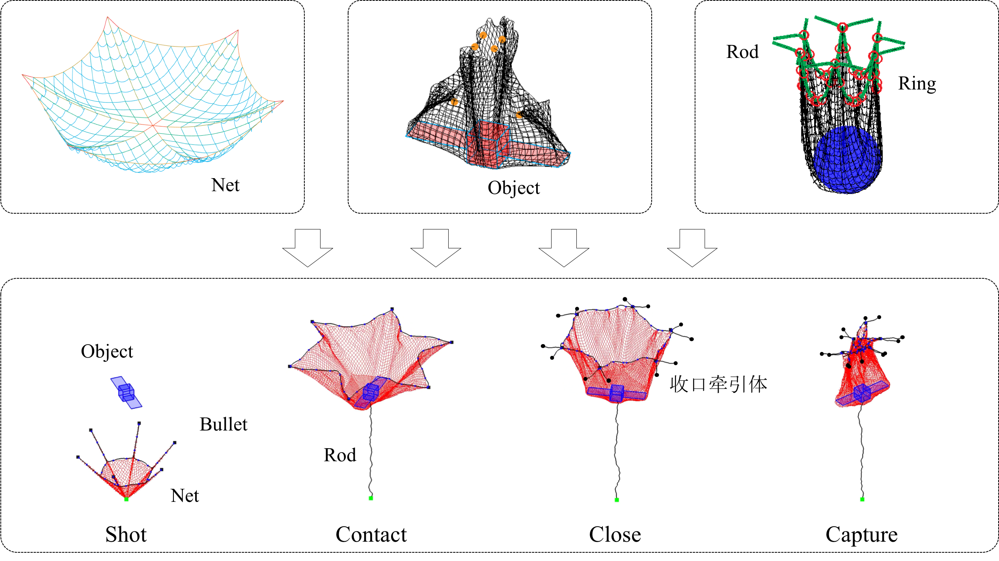
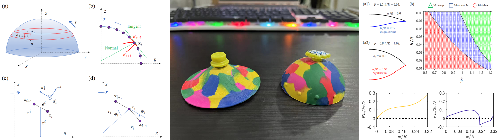
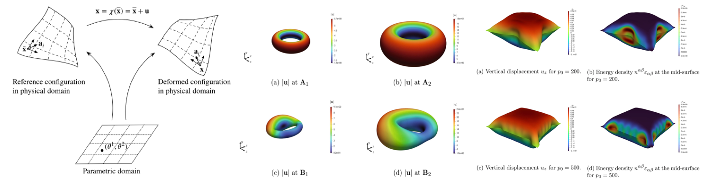



---

<video src='../images/123.mov' width=180/>

  
**SMA-powered soft robots**

Dynamic simulation of shape memory alloy-powered soft robots, for both on-land motion and underwater swimming.

 

---

<video src='your URL here' width=180/>
  
**Magnetic rods & robots**

Magnetoelastic model for slender structures and the associated framework for the magnetic-powered soft robots.

 

---

**Flagellar proposition**

Fluid-structure interaction model for a soft filament moving in a viscous fluid to mimic the bio-locomotion of bacterial flagella.

 

---

**Bifurcation of elastic strips**

Buckling, snapping, and bifurcation of an elastic strip subjected to different boundary conditions.

 

---

**Foldable annular ribbons**

Integration of in-plane kinks and out-of-plane creases to achieve a tunable folding in annular ribbons.

 

---

**Mechanics of Gridshells**

Nonlinear mechanics of multiple rod systems.

 

---

**Space net capture system**

Numerical simulation of a space net capture system.

 

---

**Axisymmetric shell**

Numerical modeling and nonlinear mechanics of axisymmetric shell structures.

 

---

**3D shell**

Isogeometric-based finite element analysis of 3D hyperelastic shells.

 

---
